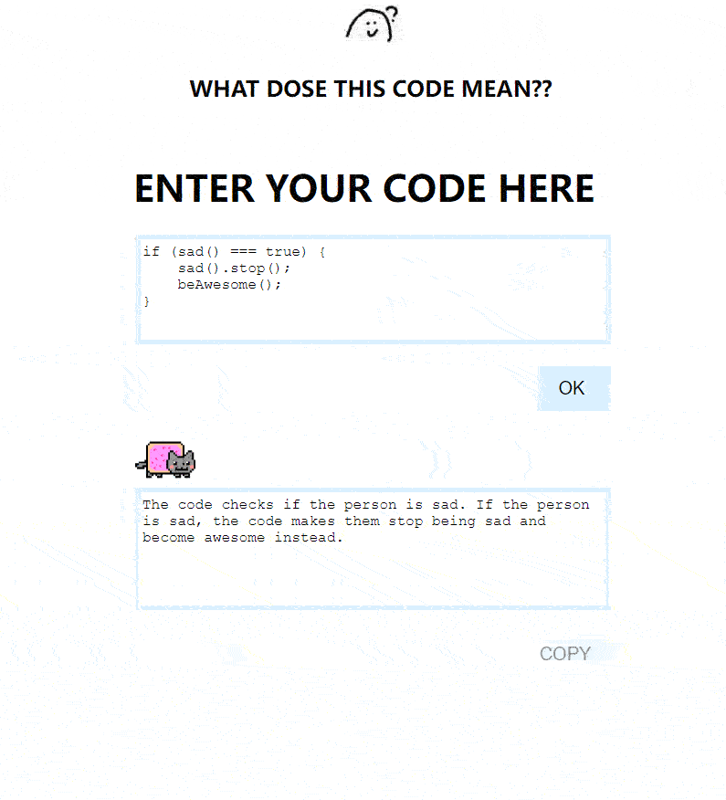

# What-does-this-code-mean

<!-- Improved compatibility of back to top link: See: https://github.com/othneildrew/Best-README-Template/pull/73 -->

`<a name="readme-top"></a>`

<!-- PROJECT LOGO -->

<br />
<div align="center">
  <a href="https://github.com/yuenci/What-does-this-code-mean">
    
  </a>

<h3 align="center">What-does-this-code-mean</h3>

<p align="center">
    An awesome web app to help you understand code!
    <br />
    <a href="https://enjoycoding.me/code/">View Demo</a>
    ·
    <a href="https://github.com/yuenci/What-does-this-code-mean/issues">Report Bug</a>
    ·
    <a href="https://github.com/yuenci/What-does-this-code-mean/issues">Request Feature</a>
  </p>
</div>

<!-- ABOUT THE PROJECT -->

## About The Project

Some modules' assignments in my university need to explain the code in documentation, and I don't like to do these meaningless things, so I wrote this project and use the  GPT-3 artificial intelligence model's powerful code explanation ability to help me complete the task. If this project helps you, star it please! Thank you!

<p align="right">(<a href="#readme-top">back to top</a>)</p>

### Built With

* Vanilla JS
* Python
* Flask

<p align="right">(<a href="#readme-top">back to top</a>)</p>

## DEMO

[DEMO](https://enjoycoding.me/code/)

<!-- GETTING STARTED -->

## Getting Started

This project uses JavaScript as the front-end language, python as as the back-end with flask framework. You can deploy it locally or on a cloud server.

### Prerequisites

* python
  ```python
  pip install flask
  pip install flask_cors
  pip install openai
  ```

### Installation

1. Get a free API Key at [https://beta.openai.com/](https://beta.openai.com/)
2. Clone the repo
   ```sh
   git clone https://github.com/yuenci/What-does-this-code-mean
   ```
3. Enter your API in `main.py`
   ```js
   API = 'ENTER YOUR API';
   ```

<p align="right">(<a href="#readme-top">back to top</a>)</p>

<!-- USAGE EXAMPLES -->

### Docker 
Check image here:
[https://hub.docker.com/r/innis/wtcm](https://hub.docker.com/r/innis/wtcm)

```sh
$ sudo docker pull innis/wtcm:1.0
$ sudo docker run  -it -p 83:83 innis/wtcm:1.0
```


## Usage

1. Paste your code into the upper input box.
2. Click the ok button.
3. Wait for generating explanation
4. Copy explanation

<div align="center">

 </div>

<p align="right">(<a href="#readme-top">back to top</a>)</p>

<!-- ROADMAP -->

## Roadmap

- [ ] Add setting function for setting api keys.
- [ ] Set whether to use animation or no
- [ ] Code highlight
- [X] Responsive layout
- [ ] Easter egg

See the [open issues](https://github.com/yuenci/What-does-this-code-mean/issues) for a full list of proposed features (and known issues).

<p align="right">(<a href="#readme-top">back to top</a>)</p>

<!-- CONTRIBUTING -->

## Authors


<!-- CONTACT -->

## License

Distributed under the GPL License. See [LICENSE](./LICENSE) for more information.

<p align="right">(<a href="#readme-top">back to top</a>)</p>
